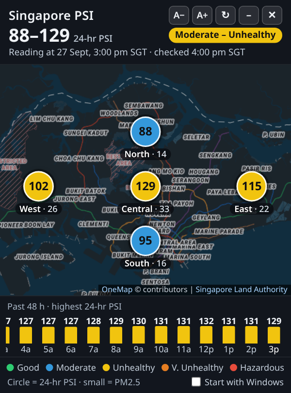
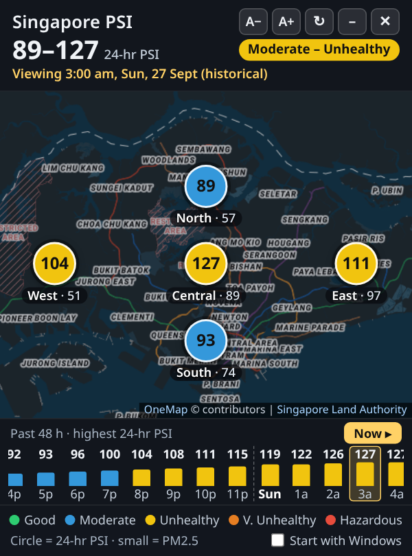

# Singapore PSI Widget

A tiny, frameless Windows desktop widget that shows the latest **Pollutant Standards Index (PSI)**
for Singapore on a map, with a scrollable **48-hour timeline**. One self-contained `.exe`, no installer,
no admin rights, no browser required.

<p align="center">
  
  &nbsp;&nbsp;
  
</p>

## Features

- **Live map** of Singapore with the 24-hr PSI for the 5 regions (North, South, East, West, Central),
  colour-coded by NEA band (Good / Moderate / Unhealthy / Very Unhealthy / Hazardous), plus 1-hr PM2.5.
- **Header** with the national range, health descriptor and reading time (SGT).
- **48-hour timeline**: one bar per hour (highest regional 24-hr PSI). Scroll with the wheel, drag or arrow
  keys; hover to preview, click to pin an hour; the map and header switch to that hour. **Now** / `Esc`
  returns to live. Auto-refresh (every 15 min) never yanks you off a selected hour.
- **Offline cache**: last readings and history are kept locally and shown with a "STALE" note when offline.
- **DPI aware** (per-monitor v2) and follows your Windows display scale, including across monitors.
- **Text size** buttons (`A−` / `A+`, 90–200%), also `Ctrl +` / `Ctrl −` / `Ctrl 0` and `Ctrl`+wheel;
  the window resizes with it and is kept on-screen.
- **Start with Windows** checkbox (per-user `HKCU\...\Run` entry, off by default).
- **Single instance**: launching again just brings the widget to the front.
- Draggable frameless window with remembered position, minimize and close buttons.

## Requirements

- Windows 10 or 11 (x64).
- **Microsoft Edge WebView2 Runtime** — built into Windows 11 (even if the Edge *browser* is removed).
  If missing, the app says so and links to the
  [WebView2 download page](https://developer.microsoft.com/microsoft-edge/webview2/).
- Internet access for live data and map tiles.

## Download and use

1. Download `SingaporePSI.zip` from the [Releases](../../releases) page (or a CI artifact) and extract it.
2. Put `SingaporePSI.exe` somewhere permanent, e.g. `%USERPROFILE%\Apps\SingaporePSI\`.
3. The exe is **not code-signed**:
   - Right-click it → **Properties** → tick **Unblock** → OK (removes the "downloaded from the internet" mark).
   - If SmartScreen says "Windows protected your PC", click **More info** → **Run anyway**.
   - Some antivirus products are cautious with new unsigned programs; you can build it yourself (below).
4. Double-click it. Tick **Start with Windows** if you want it at every sign-in
   (or put a shortcut in `shell:startup`).

Per-user files: `%LOCALAPPDATA%\PSIWidget\` (extracted UI + WebView2 profile) and
`%APPDATA%\PSIWidget\settings.json` (position, text size). Delete them to reset.
See [docs/USER-README.txt](docs/USER-README.txt) for end-user instructions.

### `--debug`

`SingaporePSI.exe --debug` shows a diagnostics line (DPI, DPI awareness, WebView2 `RasterizationScale`,
`ZoomFactor`, client size, runtime version) and enables right-click / F12 DevTools.

## Building

Requires [Go](https://go.dev/dl/) (version in `go.mod`; newer Go versions download the right toolchain
automatically). The build embeds an icon, version info and a manifest (per-monitor-v2 DPI awareness,
`asInvoker`) generated by [go-winres](https://github.com/tc-hib/go-winres) — the scripts run it via
`go run`, so nothing needs to be installed. No cgo, no packer.

**Windows** (Command Prompt):

```bat
build.bat
```

**Linux / macOS** (cross-compile):

```sh
./build.sh
```

Both produce `dist/SingaporePSI.exe`. The equivalent manual steps:

```sh
go run github.com/tc-hib/go-winres@v0.3.3 make --in winres/winres.json --arch amd64   # -> rsrc_windows_amd64.syso
GOOS=windows GOARCH=amd64 CGO_ENABLED=0 go build -trimpath -ldflags "-H windowsgui -s -w" -o dist/SingaporePSI.exe .
```

`-H windowsgui` avoids a console window. Tests: `go test ./...` on Windows
(the registry test only runs with `PSI_TEST_REGISTRY=1`).

**CI**: `.github/workflows/build.yml` builds on `windows-latest` for every push/PR and uploads the exe as an
artifact; pushing a `v*` tag also attaches `SingaporePSI.zip` to the GitHub Release.

To redraw the app icon: `go run ./tools/mkicon winres/icon.png`.

## Project structure

```
main_windows.go       window, WebView2 host, DPI/zoom handling, JS <-> Go messages
win32_windows.go      small Win32 API wrappers (user32, shcore, dwmapi, ...)
autostart_windows.go  "Start with Windows" via HKCU\Software\Microsoft\Windows\CurrentVersion\Run
host_windows_test.go  unit tests (Windows only)
main_other.go         stub so the package builds on non-Windows
web/index.html        the whole UI (HTML/CSS/JS), embedded with go:embed
web/vendor/leaflet/   vendored Leaflet 1.9.4 (BSD-2-Clause)
winres/               icon.png + winres.json (version info, manifest) for go-winres
tools/mkicon/         generator for winres/icon.png
docs/                 screenshots and end-user README
build.sh, build.bat   build scripts
```

## How it works

- **Data**: the page calls `https://api-open.data.gov.sg/v2/real-time/api/psi` (and `/pm25`), falling back to the
  legacy `https://api.data.gov.sg/v1/environment/psi` (and `/pm25`). Both send `Access-Control-Allow-Origin: *`.
  History uses `?date=YYYY-MM-DD` (SGT), which returns every hourly reading for that day
  (today + the two previous days are fetched to cover 48 h; complete past days are cached in `localStorage`).
  Note: the v1 API omits the 00:00 reading.
- **Rate limits**: the anonymous v2 API allows roughly 6 requests per 10 s and its HTTP 429 replies carry no CORS
  header (they look like network errors in the browser), so all v2 calls are spaced ≥ 2 s apart.
- **Hosting**: the embedded `web/` folder is extracted to `%LOCALAPPDATA%\PSIWidget\app` and served to WebView2
  through `SetVirtualHostNameToFolderMapping` as `https://psi-widget.example/` — no local HTTP server or open port,
  and a stable origin so `localStorage` survives restarts. The WebView2 user-data folder is
  `%LOCALAPPDATA%\PSIWidget\WebView2`.
- **go-webview2 notes** (v1.0.23):
  - `ICoreWebView2Controller3.PutRasterizationScale` passes a *pointer* to the `double` instead of its value, so
    WebView2 gets garbage. This app calls the vtable entry directly with `math.Float64bits(scale)`
    (the Go Windows syscall trampoline mirrors integer argument registers into XMM0–3, so a `double` by value works).
    The library also sets `ShouldDetectMonitorScaleChanges(false)`, so the app sets
    `RasterizationScale = dpi/96` itself at startup and on `WM_DPICHANGED`.
  - `ICoreWebView2Environment.CreateWebResourceResponse` shadows its stream variable (empty bodies), which is why
    virtual-host folder mapping is used instead of `WebResourceRequested`.
  - The default pure-Go loader is used (no in-memory DLL loading).
- **Window**: frameless `WS_POPUP` window; dragging is done by posting `WM_NCLBUTTONDOWN/HTCAPTION` when the page
  reports a mousedown outside controls and the timeline. Single instance via a named mutex.

## Data sources and attribution

- Air-quality data: **National Environment Agency (NEA)** via **data.gov.sg**, used under the
  [Singapore Open Data Licence v1.0](https://data.gov.sg/open-data-licence).
- Map tiles: **OneMap**, © Singapore Land Authority; fallback **Esri** World Dark Gray Canvas.
- Map library: **Leaflet** (BSD-2-Clause).

This project is not affiliated with NEA, GovTech, SLA or Esri. PSI values are shown as published; for official
advisories see [haze.gov.sg](https://www.haze.gov.sg/). Full details: [THIRD_PARTY_NOTICES.md](THIRD_PARTY_NOTICES.md).

## Contributing

Issues and pull requests are welcome.

- Keep it a single self-contained exe with no runtime dependencies beyond WebView2.
- Please don't add packers (UPX etc.) — they trigger antivirus false positives.
- UI changes: `web/index.html` also works in a normal browser (serve the `web/` folder with any static server);
  desktop-only controls are hidden there.
- Run `go vet ./...` (with `GOOS=windows`) and `go test ./...` on Windows before submitting.
- Be gentle with the data.gov.sg API (keep the 15-minute refresh and request spacing).

## License

[MIT](LICENSE) © 2026 Gautham Palaniappan. Third-party components keep their own licenses
(see [THIRD_PARTY_NOTICES.md](THIRD_PARTY_NOTICES.md)).
